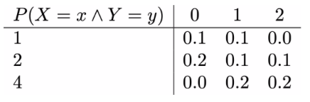

# Manipulating probability mass functions

Consider the following example problem, which was given on the problem sheet you have just completed.

The following table gives the join probability mass for the random variables, X and Y (with Y along the top):



Calculate ), ), ), ), ) and ).

The question is not particularly difficult.  It is, however, tedious as you have to do lots of addition and multiplication.  The idea in this exercise is thus to spend some time learning how to get a computer to do all these boring bits for us.

Notice that I have created two 1D NumPy arrays called you called `xvals` and `yvals`.   These two arrays hold the various values that the random variable X can take and the various values that the random variable Y can take, which we have taken from the top row and the left-most column of the table above.  The probabilities from that table are then in a 2D NumPy array called `jpmass` because we have this table of data so we need to specify a number for the row we are taking data from and a number for the column we are taking from to extract a particular value.  

To see how these 2D NumPy arrays work trying adding the command:

````
print( jpmass )
````

at the end of the code and run you should thus see that all the data on the probability mass function printed out in the terminal window on the bottom left.  If you look at the end of all the numbers that are printed you will see that the printout ends with  ] ] as opposed to simply ] we have seen when we printed NumPy arrays in the past.  The reason for this is we are using a two-dimensional NumPy array here.  We thus need two indices in order to print a specific element of this array.  To see what I mean try replacing the print statement you just wrote with the following one:

````
print( jpmass[2,1] )    
````

If you now run the command and look at the output you should see that the single number that is output by this command is the same as the number in the third column and the second row of the table.  You can experiment with commands such as the one above in order to better understand how to print specific numbers from the table.  Once you are happy with this idea replace the print statement with:

````
print( allsamples[1,:] )   
````

You should now see that a 1D NumPy array is output.  Furthermore, the numbers in this 1D NumPy array should be the same as the numbers in the second row of the table above. Now notice that print is just another function and that if you write something similar to the above in any other function a 1D NumPy array will be passed to the function.

With these instructions in mind see if you can write code to complete the functions as follows:

1. `xmarginal` - should return the marginal distribution ) 
2. `ymarginal` - should return the marginal distribution ) 
3. `expectation_x` - should return ) 
4. `expectation_y` - should return )
5  `cov_xy` - should return ) 
6. `rho_xy` - should return )

Isn't that better than doing this problem with your calculator?  
